# Charts

The [datachart.charts](../../references/charts/index.md) module of the `datachart` package provides various chart types to create data visualizations. The module is designed to be highly customizable and easy to use.

The charts are grouped by the question they answer. Each card names a chart, says what it is for, and links to its how-to guide. The chips under the name say how the chart composes with the other charts through the [composition](../composition/index.md) functions:

- Panel — the chart can be overlaid with other charts in one coordinate space through [Panel](../utility/panel.ipynb). A chart that owns its whole axes (the heatmap, Sankey chart, treemap, network chart, calendar heatmap, and scatter matrix) or draws a mirrored or task axis (the pyramid and gantt charts) cannot, and shows Panel. The box, violin, raincloud, and ridgeline plots overlay with other kinds of charts, but a panel holds one dataset of each of these kinds.
- Grid — the chart can take a cell of a combined figure through [Grid](../utility/grid.ipynb). Every chart can.

A finished chart goes further through the [composition](../composition/index.md) guides, the [styling](../styling/index.md) guides, and the [utility](../utility/index.md) guides.

## Trends and Comparisons

Values along an axis or across categories: how a quantity moves and how the categories compare.

-   [Line Chart](linechart.ipynb)

    [Panel](../utility/panel.ipynb){ .chip } [Grid](../utility/grid.ipynb){ .chip }

    How a value moves along a continuous axis, and how the trajectories of several series compare.

    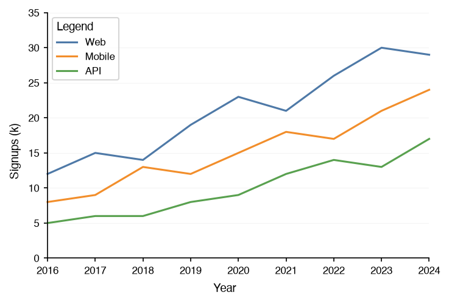

-   [Stacked Area Chart](stackedareachart.ipynb)

    [Panel](../utility/panel.ipynb){ .chip } [Grid](../utility/grid.ipynb){ .chip }

    How a total splits into parts along an axis: the top edge traces the total, the bands its composition.

    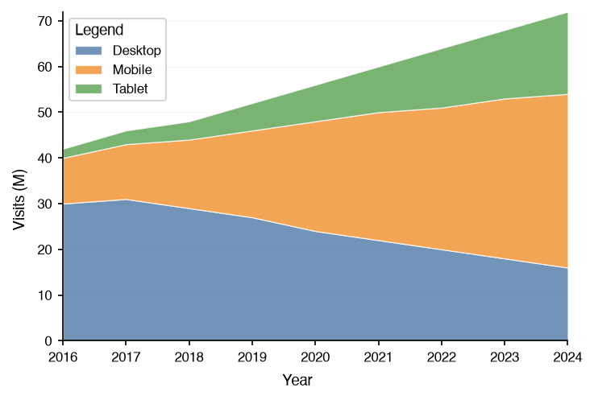

-   [Bump Chart](bumpchart.ipynb)

    [Panel](../utility/panel.ipynb){ .chip } [Grid](../utility/grid.ipynb){ .chip }

    Rank over time: who leads and who overtakes whom, with each series named at the end of its line.

    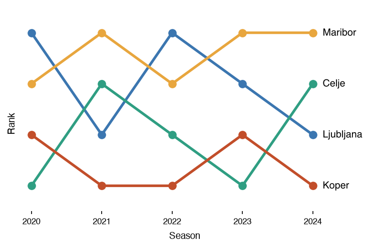

-   [Bar Chart](barchart.ipynb)

    [Panel](../utility/panel.ipynb){ .chip } [Grid](../utility/grid.ipynb){ .chip }

    A numeric value across a few categories; several series can be grouped, stacked, or overlaid.

    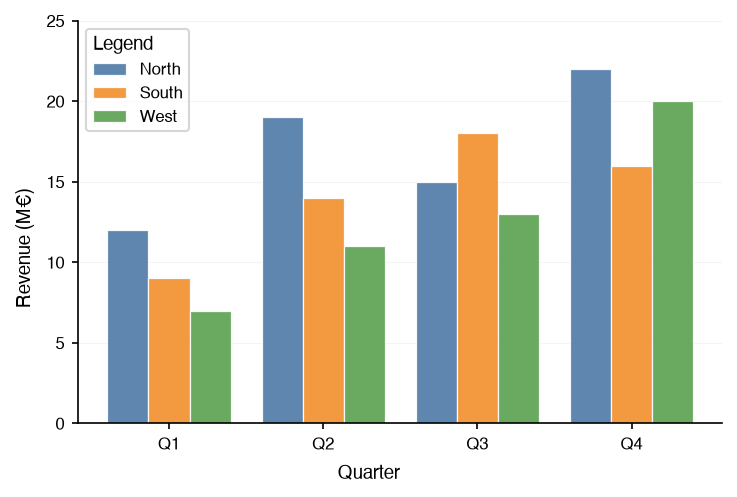

-   [Pyramid Chart](pyramidchart.ipynb)

    Panel [Grid](../utility/grid.ipynb){ .chip }

    Two groups mirrored over the same ordered categories, such as an age-sex population pyramid.

    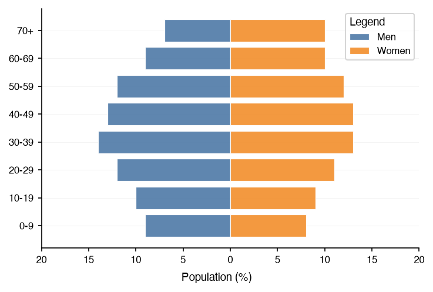

-   [Radial Chart](radialchart.ipynb)

    [Panel](../utility/panel.ipynb){ .chip } [Grid](../utility/grid.ipynb){ .chip }

    Series on polar axes: a radar profile over several metrics, or bars over cyclic categories.

    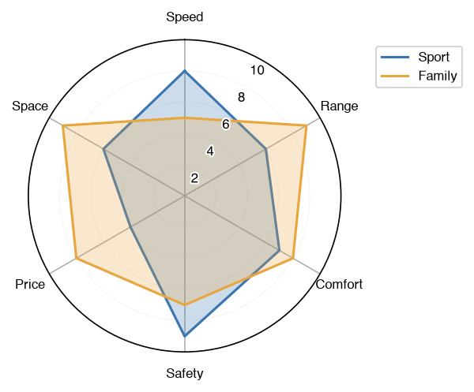

-   [Calendar Heatmap](calendarheatmap.ipynb)

    Panel [Grid](../utility/grid.ipynb){ .chip }

    One cell per day, weeks as columns, for a daily series with a weekly or seasonal rhythm.

    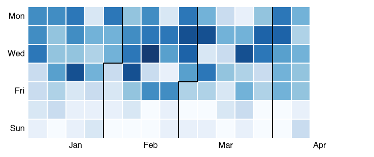

-   [Gantt Chart](ganttchart.ipynb)

    Panel [Grid](../utility/grid.ipynb){ .chip }

    A schedule: one bar per task over a date axis, with groups, progress, milestones, and dependencies.

    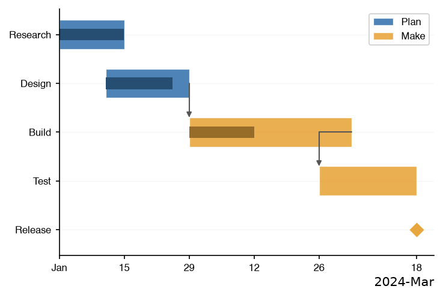

-   [Dumbbell Chart](dumbbellchart.ipynb)

    [Panel](../utility/panel.ipynb){ .chip } [Grid](../utility/grid.ipynb){ .chip }

    Two values per category and the gap between them: before and after, or a minimum and a maximum.

    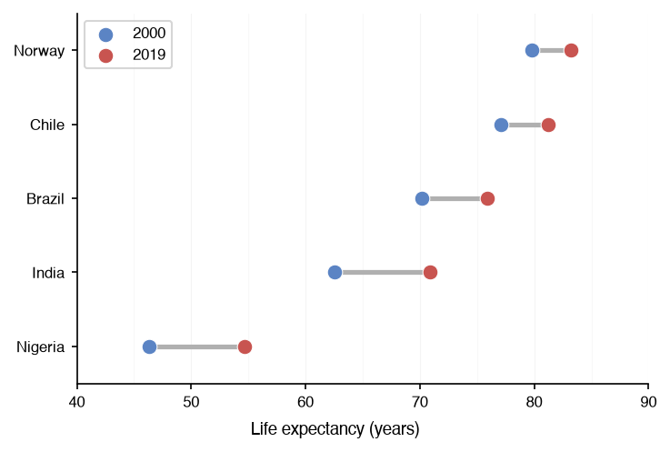

## Distributions

The spread of the values within each group, from a binned summary to every observation.

-   [Histogram](histogram.ipynb)

    [Panel](../utility/panel.ipynb){ .chip } [Grid](../utility/grid.ipynb){ .chip }

    The shape of one numeric variable, binned into counts; a few distributions can be overlaid.

    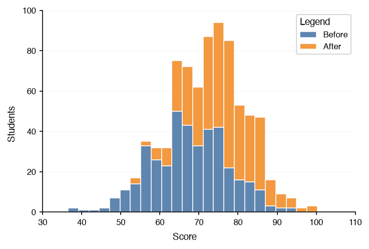

-   [Box Plot](boxplot.ipynb)

    [Panel](../utility/panel.ipynb){ .chip } [Grid](../utility/grid.ipynb){ .chip }

    The median, quartiles, whiskers, and outliers per group, for comparing many groups compactly.

    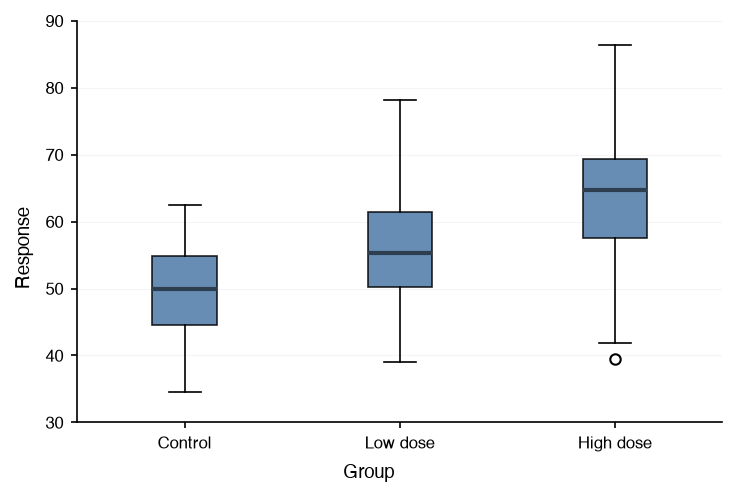

-   [Violin Plot](violinplot.ipynb)

    [Panel](../utility/panel.ipynb){ .chip } [Grid](../utility/grid.ipynb){ .chip }

    The density profile of each group, showing the skew and the modes that a box plot hides.

    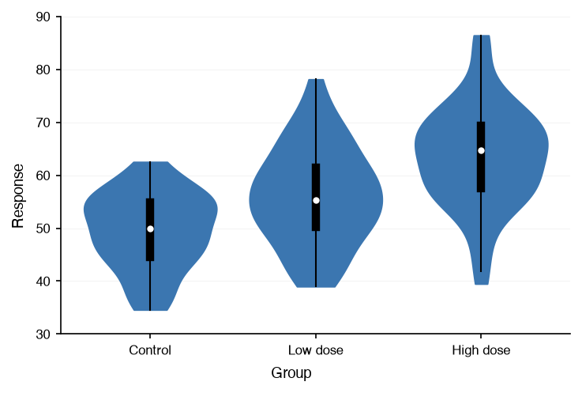

-   [Swarm Plot](swarmplot.ipynb)

    [Panel](../utility/panel.ipynb){ .chip } [Grid](../utility/grid.ipynb){ .chip }

    Every observation as a point at its group, spread so that none hide; for small to medium samples.

    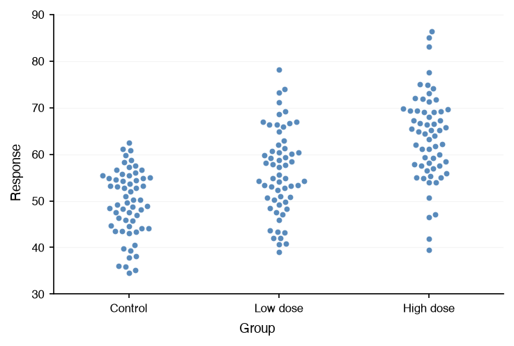

-   [Raincloud Plot](raincloudplot.ipynb)

    [Panel](../utility/panel.ipynb){ .chip } [Grid](../utility/grid.ipynb){ .chip }

    The density, the raw observations, and the quartile box of each group, side by side in one view.

    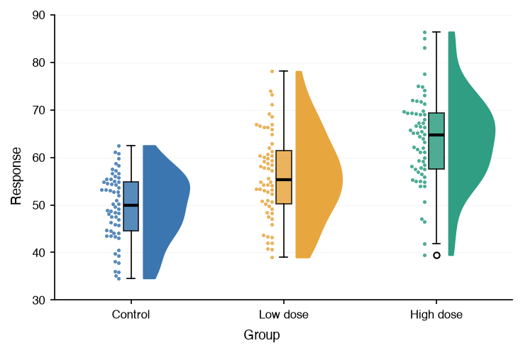

-   [Ridgeline Plot](ridgelineplot.ipynb)

    [Panel](../utility/panel.ipynb){ .chip } [Grid](../utility/grid.ipynb){ .chip }

    One density ridge per group, stacked and overlapping: how a distribution shifts across many groups.

    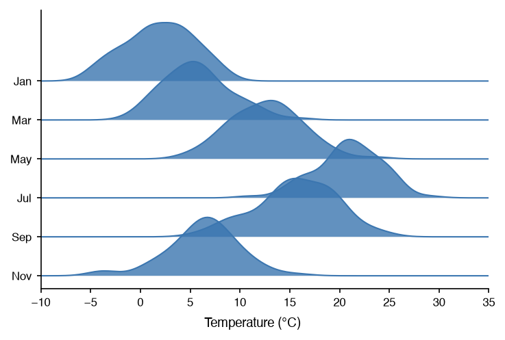

## Relationships

How two or more variables relate to each other.

-   [Scatter Chart](scatterchart.ipynb)

    [Panel](../utility/panel.ipynb){ .chip } [Grid](../utility/grid.ipynb){ .chip }

    Two numeric variables per observation, with an optional regression line and correlation coefficient.

    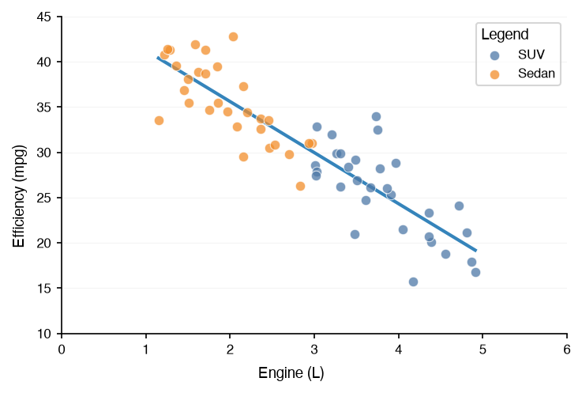

-   [Heatmap](heatmap.ipynb)

    Panel [Grid](../utility/grid.ipynb){ .chip }

    Every cell of a matrix as a color: correlations, confusion matrices, feature-by-time tables.

    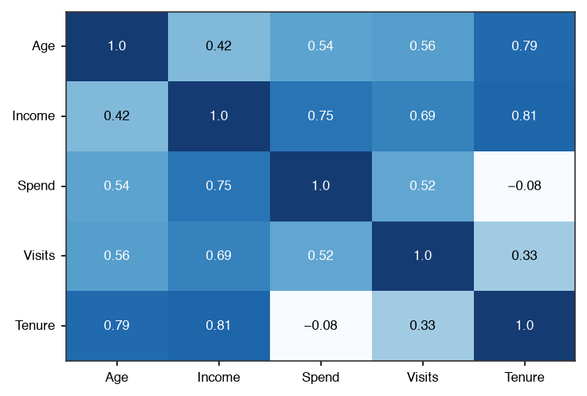

-   [Contour Chart](contourchart.ipynb)

    [Panel](../utility/panel.ipynb){ .chip } [Grid](../utility/grid.ipynb){ .chip }

    A surface sampled on a grid, as iso-lines or filled bands: densities, loss landscapes, terrain.

    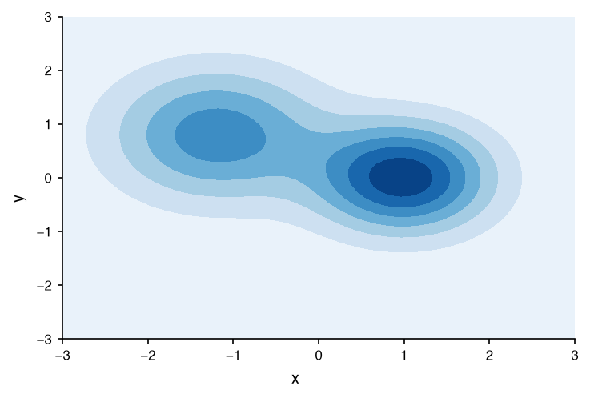

-   [Hexbin Chart](hexbinchart.ipynb)

    [Panel](../utility/panel.ipynb){ .chip } [Grid](../utility/grid.ipynb){ .chip }

    Point density on hexagonal tiles, where a scatter chart would turn into an opaque blob.

    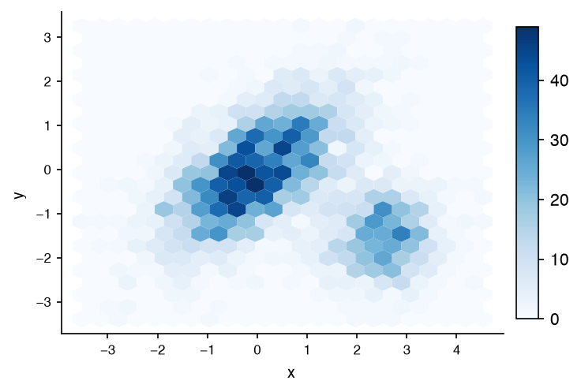

-   [Parallel Coordinates](parallelcoords.ipynb)

    [Panel](../utility/panel.ipynb){ .chip } [Grid](../utility/grid.ipynb){ .chip }

    Each record as a polyline across one axis per dimension, colored by group to compare the groups.

    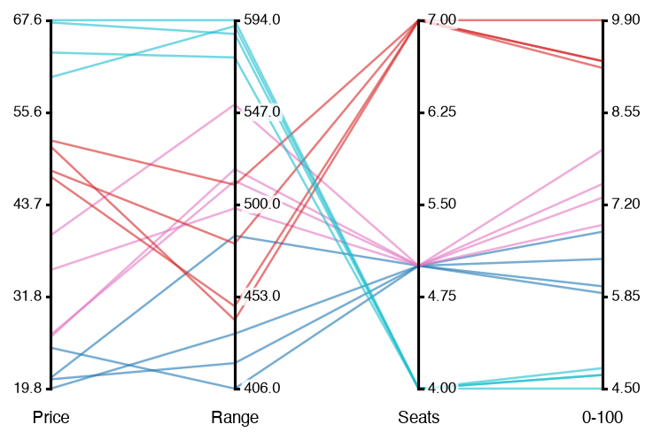

-   [Network Chart](networkchart.ipynb)

    Panel [Grid](../utility/grid.ipynb){ .chip }

    Relational data as a node-link diagram: edge weight sets the width, node group sets the color.

    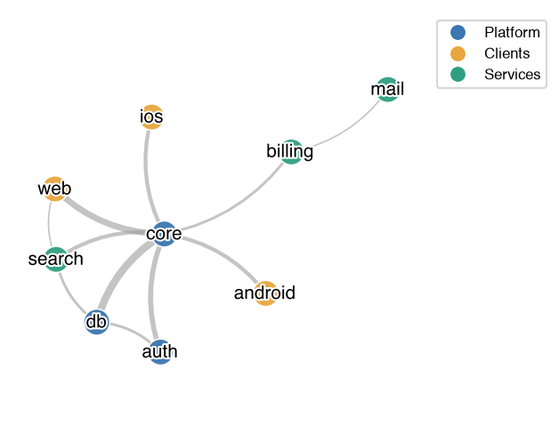

-   [Scatter Matrix](scattermatrix.ipynb)

    Panel [Grid](../utility/grid.ipynb){ .chip }

    A scatter chart for every pair of dimensions, with each dimension's distribution on the diagonal.

    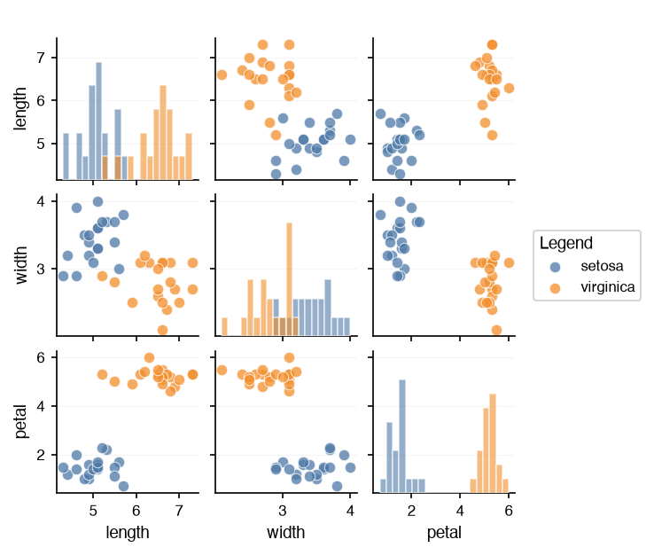

-   [Image Chart](imagechart.ipynb)

    [Panel](../utility/panel.ipynb){ .chip } [Grid](../utility/grid.ipynb){ .chip }

    A picture in data coordinates, under or over another chart: a map, a floor plan, a microscope image.

    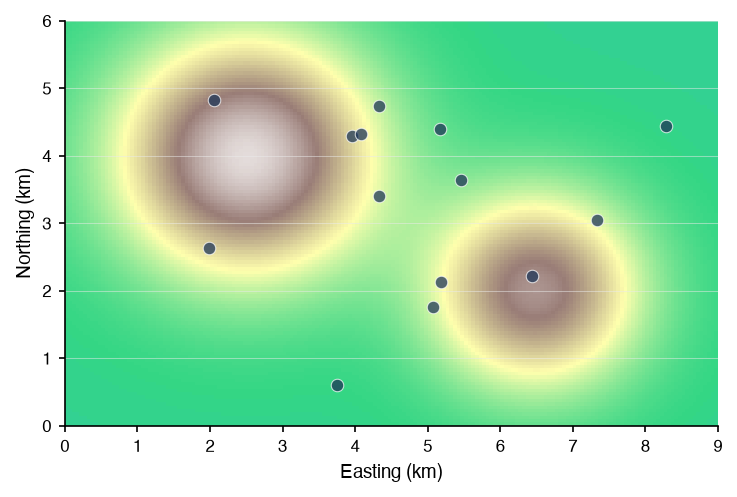

-   [Basemap Chart](basemapchart.ipynb)

    [Panel](../utility/panel.ipynb){ .chip } [Grid](../utility/grid.ipynb){ .chip }

    Coastlines, land, borders, lakes, rivers and roads under a chart of longitude and latitude, from Natural Earth.

    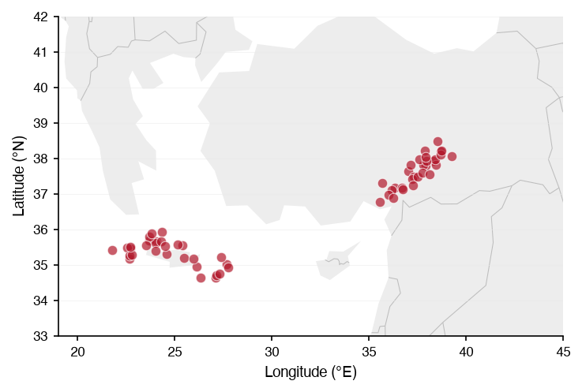

## Flows

How a quantity moves between categories: where it comes from and where it goes.

-   [Sankey Chart](sankeychart.ipynb)

    Panel [Grid](../utility/grid.ipynb){ .chip }

    Weighted flows between categories through ordered stages: funnels, label transitions, energy budgets.

    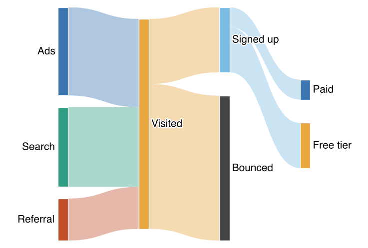

## Part of a Whole

How a whole splits into parts, and parts into smaller parts.

-   [Treemap](treemap.ipynb)

    Panel [Grid](../utility/grid.ipynb){ .chip }

    Part-of-whole data as nested rectangles whose area is the value, up to four levels deep.

    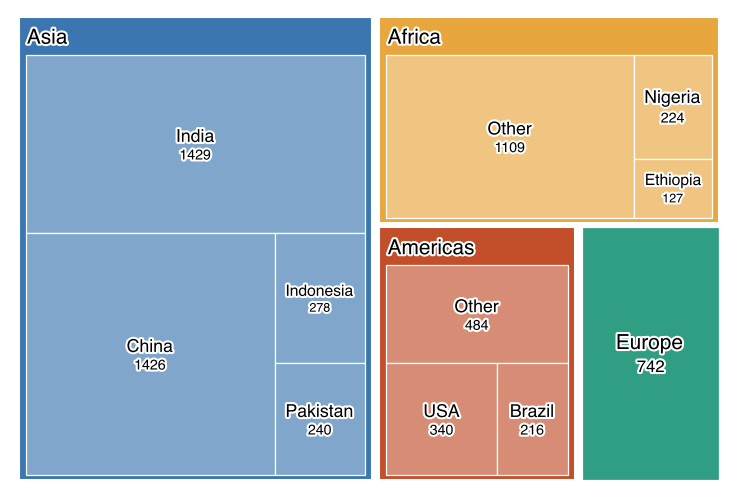

## Across Charts

The options every chart shares, worth a guide of their own.

-   [Highlighting](../styling/highlighting.ipynb)

    Emphasizing and muting data series with the `emphasis` option, by role or by rule, on any chart.

    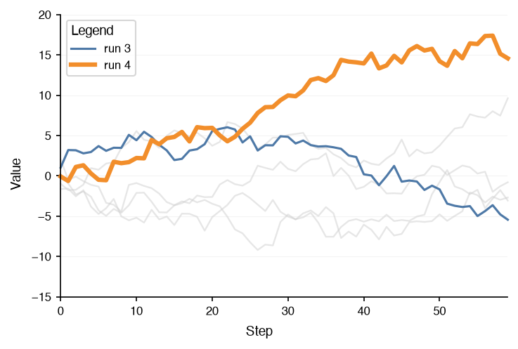

