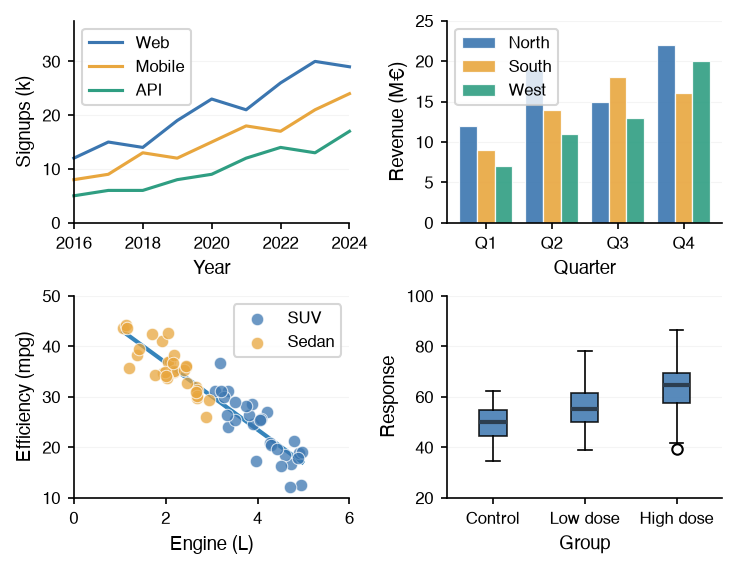

# How-to Guides

The how-to guides showcase how to utilize the `datachart` package: creating charts that reflect the data and the message the user wants to send, composing multiple charts into panels and grids, styling everything through themes and the global configuration, and the utilities around a figure.

-   [Charts](charts/index.md)

    One guide per chart type, grouped by the question the chart answers, and the highlighting guide that applies to all of them.

    

-   [Composition](composition/index.md)

    Overlaying charts with `Panel`, arranging them with `Grid`, and annotating charts and finished figures.

    

-   [Styling](styling/index.md)

    The global configuration, the predefined themes and how to create your own, and the colormaps.

    

-   [Utility](utility/index.md)

    The statistical helpers, saving figures to files and web pages, and interactive figures.

    

