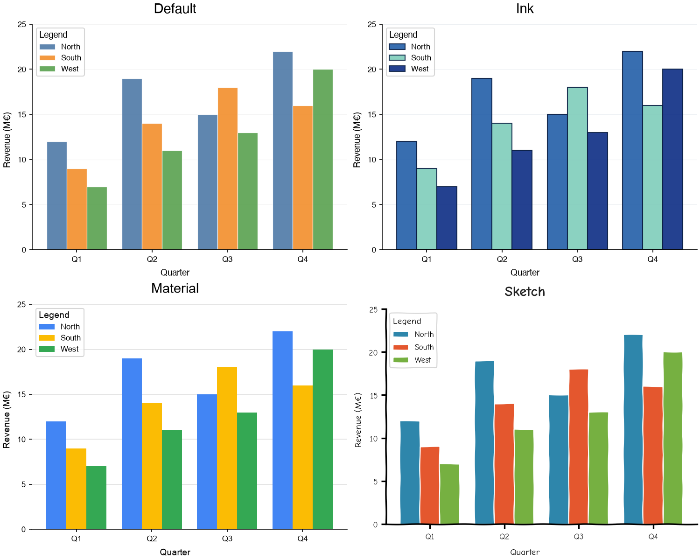
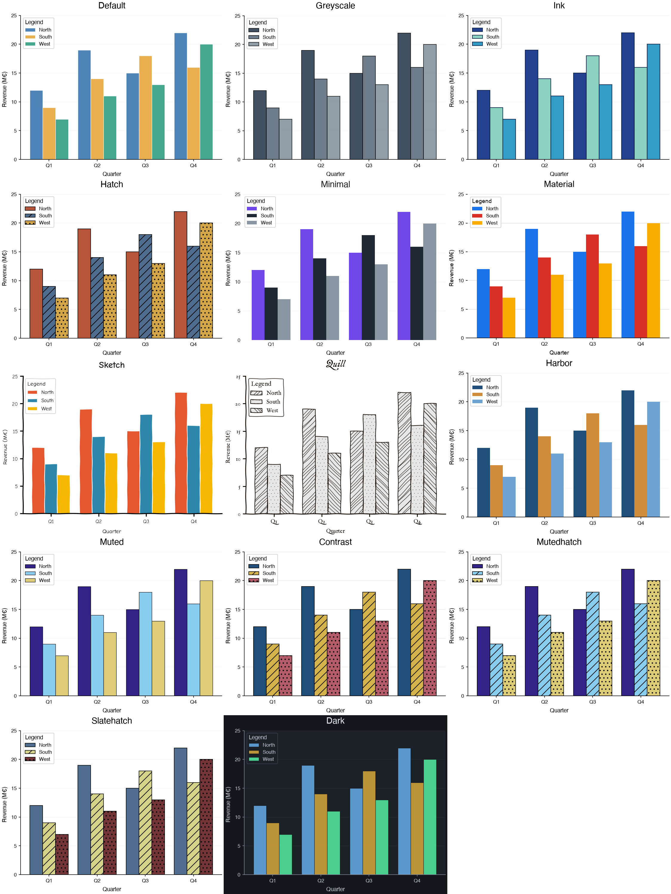
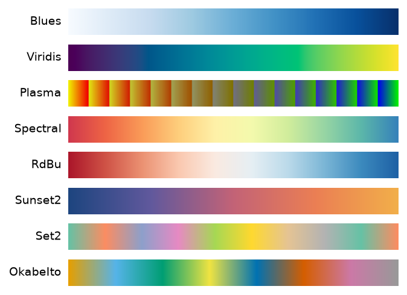

# Styling

The styling guides cover everything that controls how charts look: the global configuration, the predefined themes and how to create your own, and the available colormaps. Each card names a guide, says what it covers, and links to it.

-   [Config](config.ipynb)

    Customizing the global style through the [config](../../references/config.md) singleton: themes, attributes, scoped changes, and theme files.

    
:material-tune:

-   [Themes](themes.ipynb)

    Applying the predefined themes with `config.set_theme`, and creating your own from a style dictionary or a theme file.

    

-   [Theme Gallery](theme-gallery.ipynb)

    Every predefined theme as a card of color swatches with hex codes and six signature charts, grouped by use, to pick one by eye.

    

-   [Colormaps](colormaps.ipynb)

    The colormaps and palettes available through the `COLORS` constant, sequential, diverging, and categorical.

    

