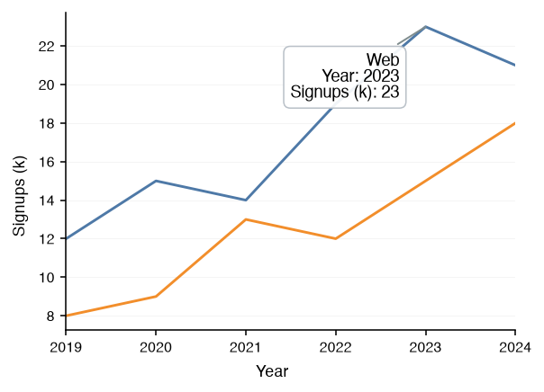

# Utility

The utilities of the [datachart.utils](../../references/utils/index.md) module around a figure: the statistics behind the charts, saving, and interactive display. Each card names a guide, says what it is for, and links to it.

-   [Statistics](stats.ipynb)

    The statistical helpers behind the charts, exposed in [datachart.utils.stats](../../references/utils/stats.md) for preparing your own data before plotting.

    
:material-sigma:

-   [Saving Figures](saving.md)

    Saves a figure to a file in vector or raster formats, and embeds it in a web page, through [datachart.utils.save_figure](../../references/utils/index.md#datachart.utils.save_figure).

    
:material-content-save-outline:

-   [Interactive Figures](interactive.md)

    Shows a figure with zoom, pan, and hover over its marks, through the `interactive` flag of every figure's `show()` method.

    

