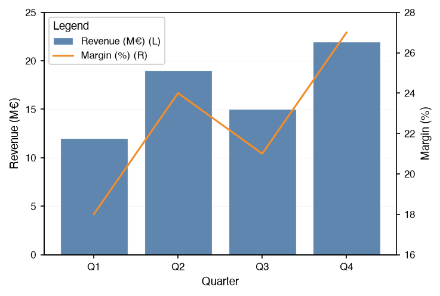
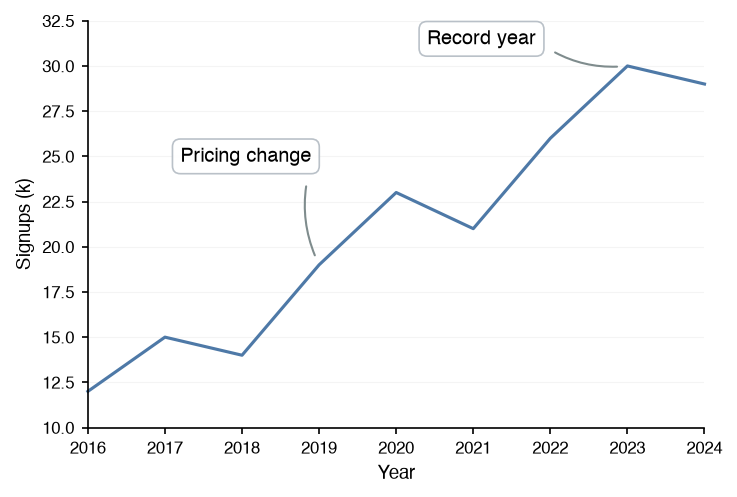

# Composition & Utilities

The [datachart.utils](../../references/utils/index.md) module of the `datachart` package provides the figure composition functions and various utilities for data visualization. Each card names a utility, says what it is for, and links to its how-to guide.

-   [Panel](panel.ipynb)

    Overlays several charts in one coordinate space, with a shared x-axis and up to two y-axes, through [datachart.utils.Panel](../../references/utils/index.md#datachart.utils.Panel).

    

-   [Grid Layout](grid.ipynb)

    Arranges several charts in the cells of one figure, with nested rows for the layout, through [datachart.utils.Grid](../../references/utils/index.md#datachart.utils.Grid).

    

-   [Text Annotations](annotations.ipynb)

    Attaches text, boxes, and connectors to a chart through its `texts` parameter, or to a finished figure through [datachart.utils.Annotate](../../references/utils/index.md#datachart.utils.Annotate).

    

-   [Statistics](stats.ipynb)

    The statistical helpers behind the charts, exposed in [datachart.utils.stats](../../references/utils/stats.md) for preparing your own data before plotting.

    
:material-sigma:

-   [Saving Figures](saving.md)

    Saves a figure to a file in vector or raster formats, and embeds it in a web page, through [datachart.utils.save_figure](../../references/utils/index.md#datachart.utils.save_figure).

    
:material-content-save-outline:

-   [Interactive Figures](interactive.md)

    Shows a figure with zoom, pan, and hover over its marks, through the `interactive` flag of every figure's `show()` method.

    

