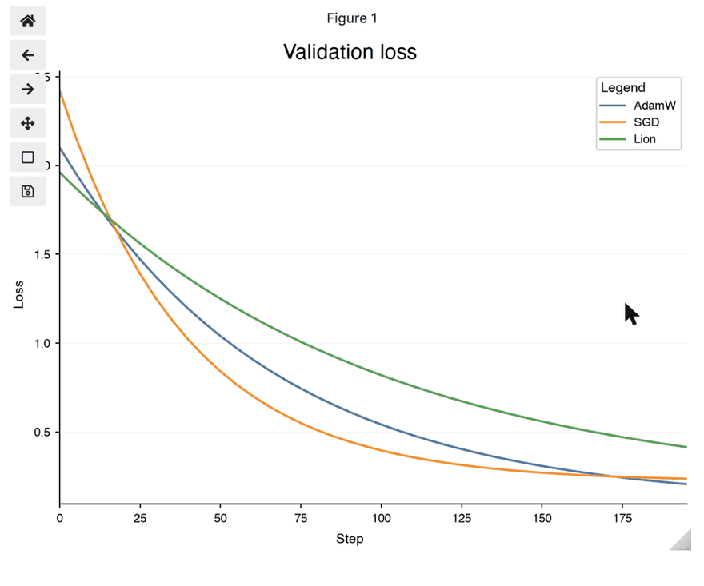

# Interactive Figures

Every figure `datachart` returns is static until shown: `figure.show()` renders it inline in a notebook and opens a GUI window in a script. Pass `interactive=True` to `show()` to zoom, pan, and hover over the marks instead. The flag is the only switch — the chart functions, `Panel`, `Grid`, and the `config` know nothing about it, and a figure shown the default way is byte-for-byte unchanged.

```python
from datachart.charts import LineChart

figure = LineChart(
    data=[{"x": i, "y": i**2} for i in range(10)],
    subtitle="growth",
    xlabel="Step",
    ylabel="Value",
)
figure.show(interactive=True)
```

The figure above, shown in a notebook, hovered and zoomed:



The recording is static because the documentation site has no Python kernel behind it; run the snippet in a notebook to get the live widget.

## Installing the extra

Interactivity needs two optional packages, [ipympl](https://matplotlib.org/ipympl/) for the notebook widget canvas and [mplcursors](https://mplcursors.readthedocs.io/) for the hover annotations. Install them with the `interactive` extra:

```bash
pip install "datachart[interactive]"   # or: uv add "datachart[interactive]"
```

Without them `show(interactive=True)` raises an `ImportError` naming the missing package and the extra. It never falls back to a static figure.

## Zoom and pan

- **Notebooks.** The figure is displayed on an `ipympl` widget canvas with the matplotlib toolbar: zoom to a rectangle, pan, step back through views, and save. The widget takes the place of the static image, so nothing is displayed twice.
- **Scripts.** The figure opens in the GUI window it always did; the window's own toolbar provides the zoom and pan.

## Hover to inspect

Hovering a mark shows an annotation with the series' legend label on the first line — its `subtitle`, or the `legend_label` a `Panel` assigned — and one `name: value` line per axis. The names are the axis labels of the chart when set (`xlabel`, `ylabel`, and a `Panel`'s `ylabel_left` / `ylabel_right`), and `x` / `y` otherwise; a series on a `Panel`'s secondary value axis reports the secondary label. Values are formatted the way the axis formats its coordinates, so a point on a category axis reports the category name. The annotation wears the theme's text annotation style — the `plot_text_*` font, box, and connector — so it matches the figure it sits on.

Hover follows the marks through composition: it works on every series of a `Panel` overlay, including those on the secondary axis, and in every cell of a `Grid`.

The chart types with hover support:

| Chart                                        | Mark          | Annotation                                  |
| :------------------------------------------- | :------------ | :------------------------------------------ |
| [Line Chart](../charts/linechart.ipynb)      | line point    | legend label, `x`, `y`                      |
| [Scatter Chart](../charts/scatterchart.ipynb) | scatter point | legend label (or the `hue` group), `x`, `y` |
| [Bar Chart](../charts/barchart.ipynb)        | bar           | legend label, category, the bar's own value |

Grouped and stacked bars report their own value, never the stack total. Every other chart type zooms and pans but shows no hover annotation.
