# Interactive Figures

Every figure `datachart` returns is static until shown: `figure.show()` renders it inline in a notebook and opens a GUI window in a script. Pass `interactive=True` to `show()` to zoom, pan, and hover over the marks instead. The flag is the only switch — the chart functions, `Panel`, `Grid`, and the `config` know nothing about it, and a figure shown the default way is byte-for-byte unchanged.

```python
from datachart.charts import LineChart

figure = LineChart(
    data=[{"x": i, "y": i**2} for i in range(10)],
    subtitle="growth",
    xlabel="Step",
    ylabel="Value",
)
figure.show(interactive=True)
```

The figure above, shown in a notebook, hovered and zoomed:


The recording is static because the documentation site has no Python kernel behind it; run the snippet in a notebook to get the live widget.

## Installing the extra

Interactivity needs two optional packages, [ipympl](https://matplotlib.org/ipympl/) for the notebook widget canvas and [mplcursors](https://mplcursors.readthedocs.io/) for the hover annotations. Install them with the `interactive` extra:

```bash
pip install "datachart[interactive]"   # or: uv add "datachart[interactive]"
```

Without them `show(interactive=True)` raises an `ImportError` naming the missing package and the extra. It never falls back to a static figure.

## Zoom and pan

- **Notebooks.** The figure is displayed on an `ipympl` widget canvas with the matplotlib toolbar: zoom to a rectangle, pan, step back through views, and save. The widget takes the place of the static image, so nothing is displayed twice.
- **Scripts.** The figure opens in the GUI window it always did; the window's own toolbar provides the zoom and pan.

## Hover to inspect

Hovering a mark shows an annotation with the series' legend label on the first line — its `subtitle`, or the `legend_label` a `Panel` assigned — and one `name: value` line per field of the mark. A mark that stands for a data point reports its axis coordinates: the names are the axis labels of the chart when set (`xlabel`, `ylabel`, and a `Panel`'s `ylabel_left` / `ylabel_right`), and `x` / `y` otherwise; a series on a `Panel`'s secondary value axis reports the secondary label. Values are formatted the way the axis formats its coordinates, so a point on a category axis reports the category name. A mark that stands for an aggregate reports its summary under plain names — a box its `median` and quartiles, a histogram bin its range and count, a sankey link its endpoints and `flow`. The annotation wears the theme's text annotation style — the `plot_text_*` font, box, and connector — so it matches the figure it sits on.

Hover follows the marks through composition: it works on every series of a `Panel` overlay, including those on the secondary axis, and in every cell of a `Grid`. Text annotations and reference lines decorate the chart and carry no hover.

Every chart type has hover support. Filled marks — bars, bands, boxes, bodies, cells, hexagons, tiles, nodes, ribbons — pick anywhere inside; lines, outlines, and network edges pick within a few points of their stroke, as do the outline of a `step` histogram and the edges of a filled contour band.

| Chart | Mark | Annotation |
| :---- | :--- | :--------- |
| [Line Chart](../charts/linechart.ipynb) | line point | legend label, `x`, `y` |
| [Stacked Area Chart](../charts/stackedareachart.ipynb) | band, at the nearest point | legend label, `x`, the series' own `y` (never the stack total) |
| [Bump Chart](../charts/bumpchart.ipynb) | line, at the nearest period | legend label, `x`, the rank as `y`, the original `value` |
| [Bar Chart](../charts/barchart.ipynb) | bar | legend label, category, the bar's own value (never the stack total) |
| [Pyramid Chart](../charts/pyramidchart.ipynb) | bar | legend label, category, the value as passed, positive |
| [Gantt Chart](../charts/ganttchart.ipynb) | task bar | legend label, `task`, `start`, `end`, `duration` in days, and `progress` when set |
| [Dumbbell Chart](../charts/dumbbellchart.ipynb) | start or end dot | legend label (the endpoint name), category, value |
| [Radial Chart](../charts/radialchart.ipynb) | point, bar, or bin | legend label, `angle` (the category, or a bin's degree range), `radius` |
| [Histogram](../charts/histogram.ipynb) | bin | legend label, the bin's range, its count (or density) |
| [Box Plot](../charts/boxplot.ipynb) | box | legend label, category, `median`, `q1`, `q3`, `min`, `max` |
| [Violin Plot](../charts/violinplot.ipynb) | body | legend label (or the split value), category, `median`, `q1`, `q3`, `min`, `max` |
| [Swarm Plot](../charts/swarmplot.ipynb) | point | legend label, category, value |
| [Raincloud Plot](../charts/raincloudplot.ipynb) | box, body, or rain point | as the box, violin, and swarm marks |
| [Ridgeline Plot](../charts/ridgelineplot.ipynb) | ridge | legend label, category, `median`, `q1`, `q3`, `min`, `max` |
| [Scatter Chart](../charts/scatterchart.ipynb) | point | legend label (or the `hue` group), `x`, `y` |
| [Heatmap](../charts/heatmap.ipynb) | cell | legend label, `x`, `y`, `value` |
| [Calendar Heatmap](../charts/calendarheatmap.ipynb) | day cell | legend label, `date`, `value` |
| [Contour Chart](../charts/contourchart.ipynb) | level line or filled band | legend label, `level` (a band's two levels) |
| [Hexbin Chart](../charts/hexbinchart.ipynb) | hexagon | legend label, `x`, `y` (the cell center), `count` (or the reduced `c` under its reducer's name) |
| [Parallel Coordinates](../charts/parallelcoords.ipynb) | row line, at the nearest axis | the `hue` value (or the legend label), the axis name and the row's value there |
| [Network Chart](../charts/networkchart.ipynb) | node or edge | node: its label, `degree` (`in` / `out` when directed, the weight sum when weighted), its `group` and `size` when given; edge: `source`, `target`, `weight` |
| [Scatter Matrix](../charts/scattermatrix.ipynb) | point, bin, or density curve | as the scatter chart and histogram marks; a density curve reports the legend label (the `hue` group), `x`, and the density as `y` |
| [Sankey Chart](../charts/sankeychart.ipynb) | node or link | node: its name, `flow`; link: `source`, `target`, `flow` |
| [Treemap](../charts/treemap.ipynb) | tile or group band | its label, `value` (a band's group total) |

The annotation on each chart, from the figure shown with `show(interactive=True)` and a mark hovered:

| **Line Chart** — a hovered point | **Stacked Area Chart** — a hovered band |
| :-- | :-- |
|  | 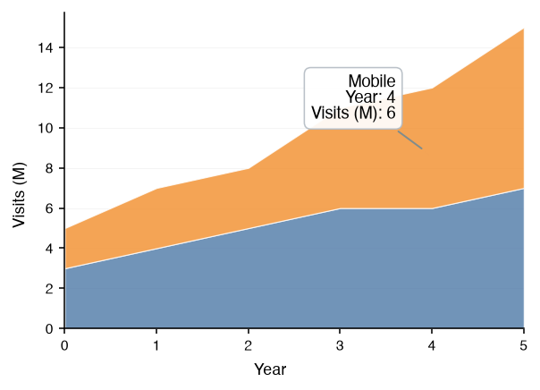 |

| **Bump Chart** — a hovered period | **Bar Chart** — a hovered bar |
| :-- | :-- |
| 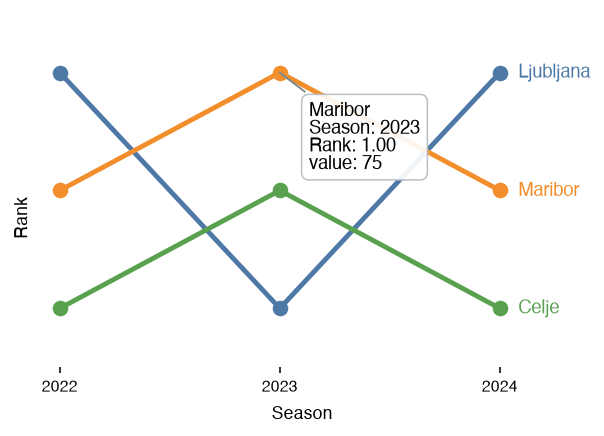 | 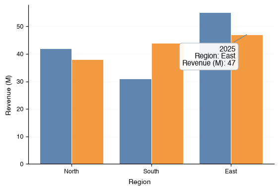 |

| **Pyramid Chart** — a hovered bar | **Gantt Chart** — a hovered task bar |
| :-- | :-- |
| 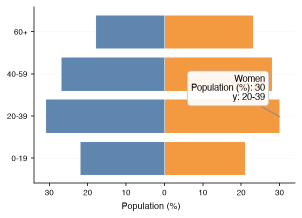 | 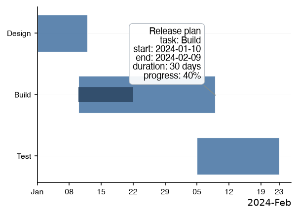 |

| **Dumbbell Chart** — a hovered start dot | **Radial Chart** — a hovered bar |
| :-- | :-- |
| 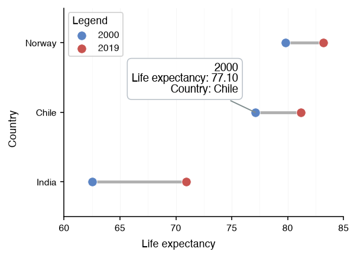 | 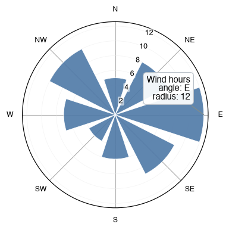 |

| **Histogram** — a hovered bin | **Box Plot** — a hovered box |
| :-- | :-- |
| 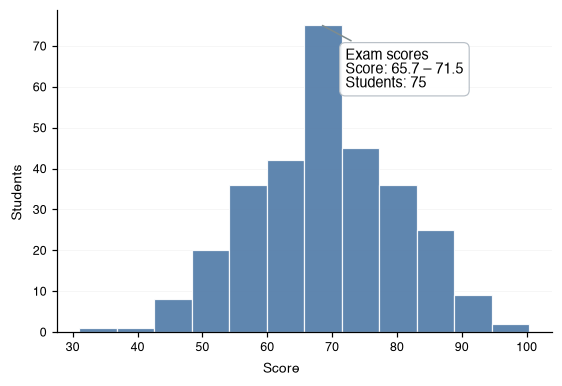 | 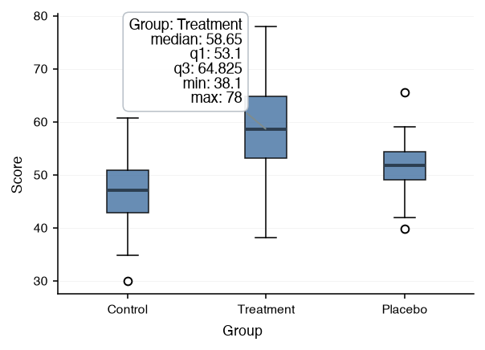 |

| **Violin Plot** — a hovered body | **Swarm Plot** — a hovered point |
| :-- | :-- |
| 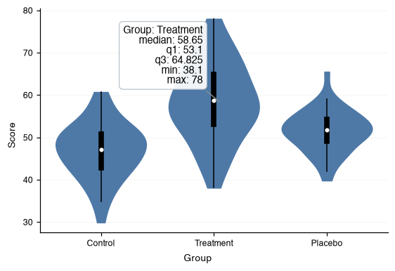 | 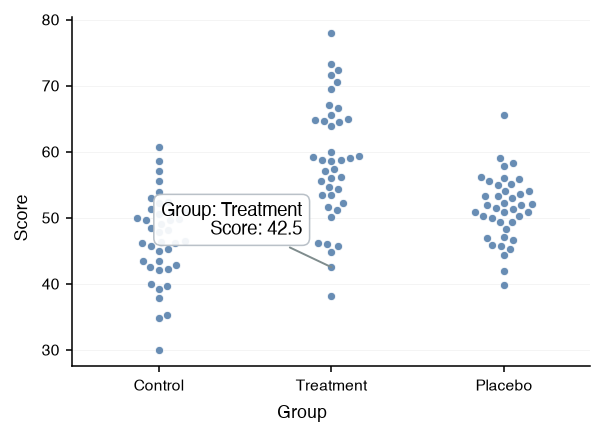 |

| **Raincloud Plot** — a hovered box | **Ridgeline Plot** — a hovered ridge |
| :-- | :-- |
| 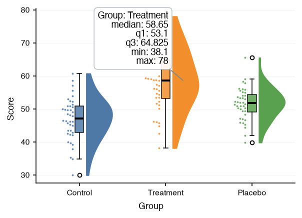 | 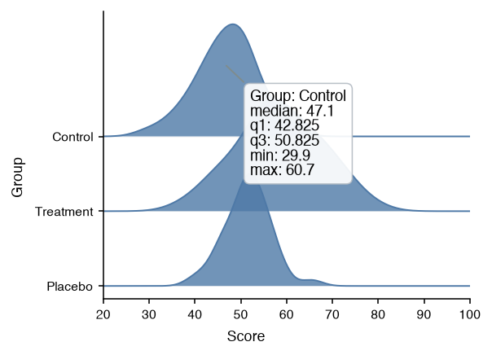 |

| **Scatter Chart** — a hovered point | **Heatmap** — a hovered cell |
| :-- | :-- |
| 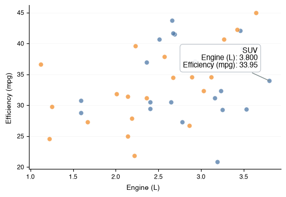 | 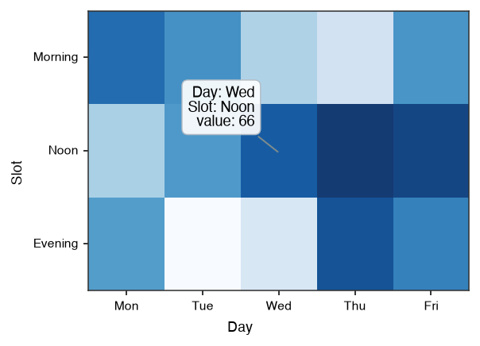 |

| **Calendar Heatmap** — a hovered day | **Contour Chart** — a hovered level line |
| :-- | :-- |
| 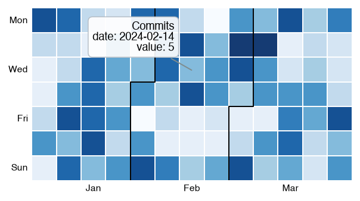 | 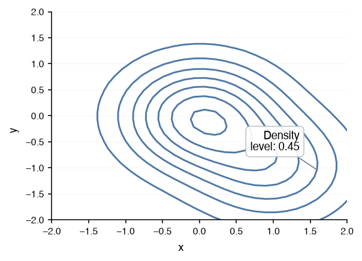 |

| **Hexbin Chart** — a hovered hexagon | **Parallel Coordinates** — a hovered row |
| :-- | :-- |
| 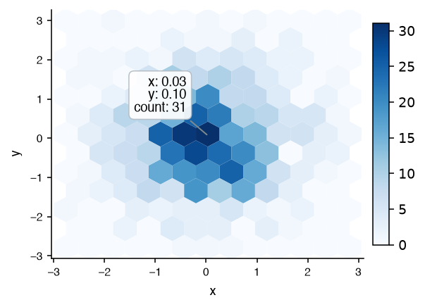 | 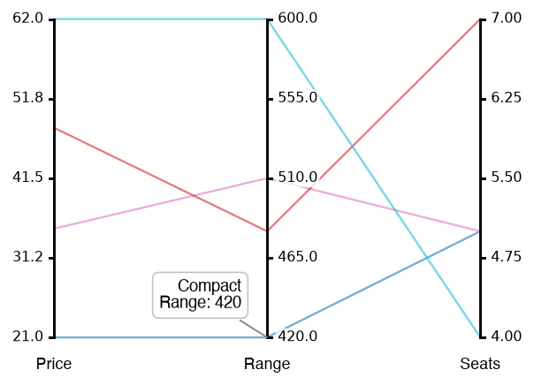 |

| **Network Chart** — a hovered node | **Scatter Matrix** — a hovered point |
| :-- | :-- |
| 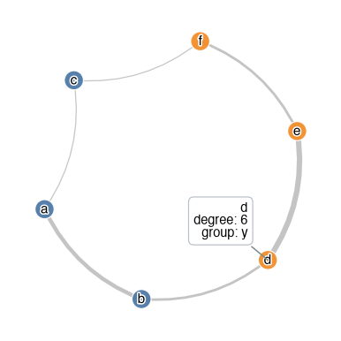 | 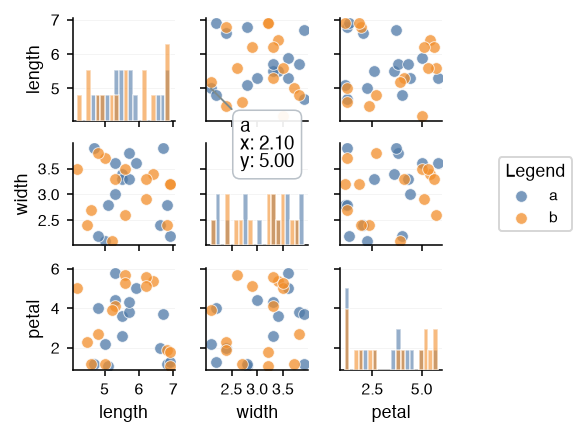 |

| **Sankey Chart** — a hovered link | **Treemap** — a hovered tile |
| :-- | :-- |
| 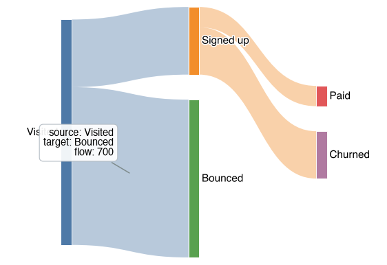 | 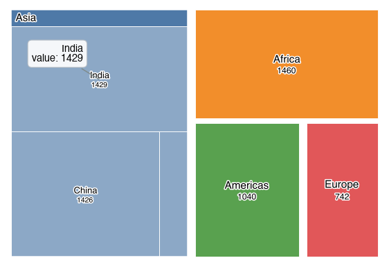 |
