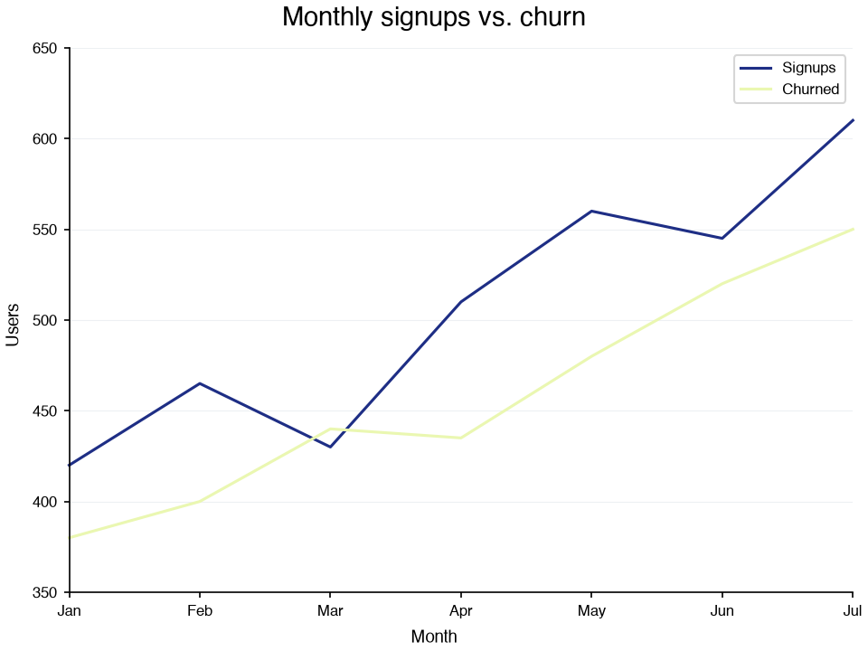

<p class="dc-eyebrow">Documentation</p>

## Find your way around

<p class="dc-lede">Start with a guide, look things up in the reference, or point your AI assistant at the docs.</p>

<!-- plain HTML: the cards carry inline icons that markdown cannot express -->
<div class="dc-cards">
  <a class="dc-card" href="how-to-guides/">
    <svg viewBox="0 0 24 24" fill="none" stroke="currentColor" stroke-width="1.8" aria-hidden="true"><path d="M4 5a2 2 0 0 1 2-2h13v16H6a2 2 0 0 0-2 2z"/><path d="M4 19V5"/><path d="M8 7h7"/></svg>
    <h3>How-to guides</h3>
    <p>Every chart type, composition with Panel and Grid, styling, and the utilities, each a runnable notebook on real data.</p>
    <span class="dc-card__more">Open the guides &rarr;</span>
  </a>
  <a class="dc-card" href="use-cases/">
    <svg viewBox="0 0 24 24" fill="none" stroke="currentColor" stroke-width="1.8" aria-hidden="true"><path d="M9 3h6"/><path d="M10 3v5.5L4.6 18a2 2 0 0 0 1.7 3h11.4a2 2 0 0 0 1.7-3L14 8.5V3"/><path d="M7.4 14.5h9.2"/></svg>
    <h3>Use cases</h3>
    <p>The figures a report in one field needs, worked through one dataset from the first figure to the last.</p>
    <span class="dc-card__more">Read the use cases &rarr;</span>
  </a>
  <a class="dc-card" href="references/">
    <svg viewBox="0 0 24 24" fill="none" stroke="currentColor" stroke-width="1.8" aria-hidden="true"><path d="m8 8-4 4 4 4"/><path d="m16 8 4 4-4 4"/><path d="m14 4-4 16"/></svg>
    <h3>API reference</h3>
    <p>Signatures and attribute tables for the charts, utils, config, themes, constants, and typings modules.</p>
    <span class="dc-card__more">Browse the reference &rarr;</span>
  </a>
  <a class="dc-card" href="how-to-guides/styling/theme-gallery/">
    <svg viewBox="0 0 24 24" fill="none" stroke="currentColor" stroke-width="1.8" aria-hidden="true"><path d="M12 3a9 9 0 1 0 0 18c1.5 0 2-1 2-2v-1a2 2 0 0 1 2-2h1a4 4 0 0 0 4-4 9 9 0 0 0-9-9z"/><circle cx="7.5" cy="11" r="1"/><circle cx="11" cy="7" r="1"/><circle cx="16" cy="8" r="1"/></svg>
    <h3>Themes and styling</h3>
    <p>Seven predefined themes, the global config, colormaps, and emphasis for the series that matters.</p>
    <span class="dc-card__more">See the theme gallery &rarr;</span>
  </a>
  <a class="dc-card" href="how-to-guides/composition/">
    <svg viewBox="0 0 24 24" fill="none" stroke="currentColor" stroke-width="1.8" aria-hidden="true"><rect x="3" y="3" width="8" height="8" rx="1"/><rect x="13" y="3" width="8" height="8" rx="1"/><rect x="3" y="13" width="8" height="8" rx="1"/><rect x="13" y="13" width="8" height="8" rx="1"/></svg>
    <h3>Composition</h3>
    <p>Overlay charts on one axes with Panel, or lay them out with Grid. Grids nest.</p>
    <span class="dc-card__more">Compose figures &rarr;</span>
  </a>
  <a class="dc-card" href="ai-assistants/">
    <svg viewBox="0 0 24 24" fill="none" stroke="currentColor" stroke-width="1.8" aria-hidden="true"><rect x="4" y="8" width="16" height="12" rx="2"/><path d="M12 8V4M8 4h8"/><circle cx="9" cy="14" r="1"/><circle cx="15" cy="14" r="1"/></svg>
    <h3>AI assistants</h3>
    <p>llms.txt, per-page markdown, and MCP servers, so a coding assistant writes datachart code from the current docs.</p>
    <span class="dc-card__more">Point your assistant here &rarr;</span>
  </a>
</div>

<div class="dc-two" markdown>

<div markdown>

<p class="dc-eyebrow">Install</p>

## Two commands, Python 3.10 or higher

<p class="dc-lede">Install from PyPI with pip or uv. Add the <code>interactive</code> extra for zoom, pan, and hover-to-inspect.</p>

=== "pip"

    ```bash
    pip install -U datachart
    ```

=== "uv"

    ```bash
    uv add datachart
    ```

=== "interactive"

    ```bash
    pip install -U "datachart[interactive]"
    ```

Every chart returns a plain matplotlib `Figure`, so anything matplotlib can do with it still works. See [Saving Figures](how-to-guides/utility/saving.md) and [Interactive Figures](how-to-guides/utility/interactive.md).

</div>

<div markdown>

<p class="dc-eyebrow">First chart</p>

## A line chart in one call

<p class="dc-lede">Every chart takes a list of series, each a list of dicts. Set a theme once and every chart follows it.</p>

```python
from datachart.charts import LineChart
from datachart.config import config
from datachart.constants import THEME

config.set_theme(THEME.INK)

months = ["Jan", "Feb", "Mar", "Apr", "May", "Jun", "Jul"]
signups = [420, 465, 430, 510, 560, 545, 610]
churned = [380, 400, 440, 435, 480, 520, 550]

figure = LineChart(
    [
        [{"x": x, "y": y} for x, y in enumerate(signups)],
        [{"x": x, "y": y} for x, y in enumerate(churned)],
    ],
    title="Monthly signups vs. churn",
    subtitle=["Signups", "Churned"],
    xlabel="Month",
    ylabel="Users",
    xticks=list(range(len(months))),
    xticklabels=months,
    show_legend=True,
)
```



</div>

</div>
