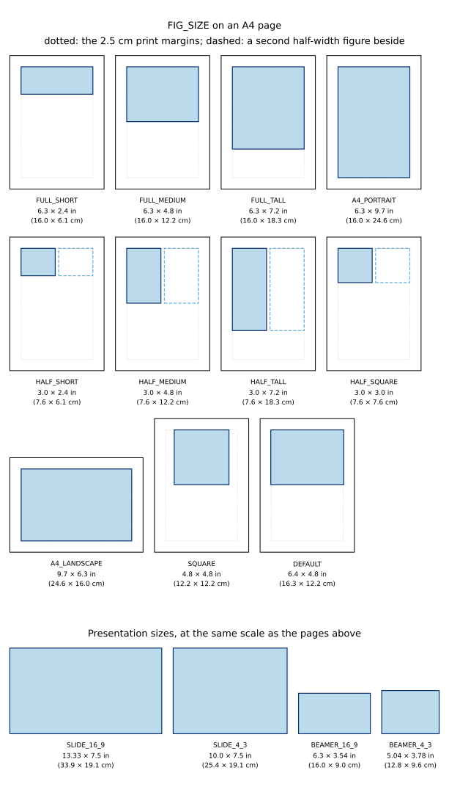

# Constants Module

::: datachart.constants
    options:
        members: False
        heading_level: 2

## Figure Constants

::: datachart.constants.FIG_SIZE
    options:
        heading_level: 3

#### Figure sizes at a glance

Every `FIG_SIZE` drawn to scale: paper sizes as the shaded area they occupy on
an A4 page (dotted outline: the standard 2.5 cm print margins the sizes are
anchored to; dashed outline: a second half-width figure placed beside), and
presentation sizes as standalone frames at the same physical scale.

::: datachart.constants.FIG_FORMAT
    options:
        heading_level: 3

## Font Constants

::: datachart.constants.FONT_STYLE
    options:
        heading_level: 3

::: datachart.constants.FONT_WEIGHT
    options:
        heading_level: 3

## Line Constants

::: datachart.constants.LINE_MARKER
    options:
        heading_level: 3

::: datachart.constants.LINE_STYLE
    options:
        heading_level: 3

::: datachart.constants.LINE_DRAW_STYLE
    options:
        heading_level: 3

## Style Constants

::: datachart.constants.HATCH_STYLE
    options:
        heading_level: 3

::: datachart.constants.COLORS
    options:
        heading_level: 3

::: datachart.constants.THEME
    options:
        heading_level: 3

::: datachart.constants.EMPHASIS
    options:
        heading_level: 3

## Legend Constants

::: datachart.constants.LEGEND_ALIGN
    options:
        heading_level: 3

::: datachart.constants.LEGEND_LOCATION
    options:
        heading_level: 3

## Chart Constants

::: datachart.constants.HISTOGRAM_TYPE
    options:
        heading_level: 3

::: datachart.constants.NORMALIZE
    options:
        heading_level: 3

::: datachart.constants.ORIENTATION
    options:
        heading_level: 3

::: datachart.constants.VALUE_FORMAT
    options:
        heading_level: 3

::: datachart.constants.SHOW_GRID
    options:
        heading_level: 3

::: datachart.constants.SCALE
    options:
        heading_level: 3

::: datachart.constants.ASPECT_RATIO
    options:
        heading_level: 3

::: datachart.constants.COLORBAR_LOCATION
    options:
        heading_level: 3
